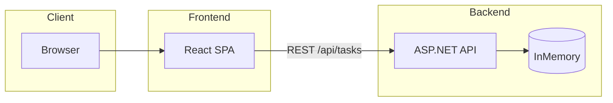
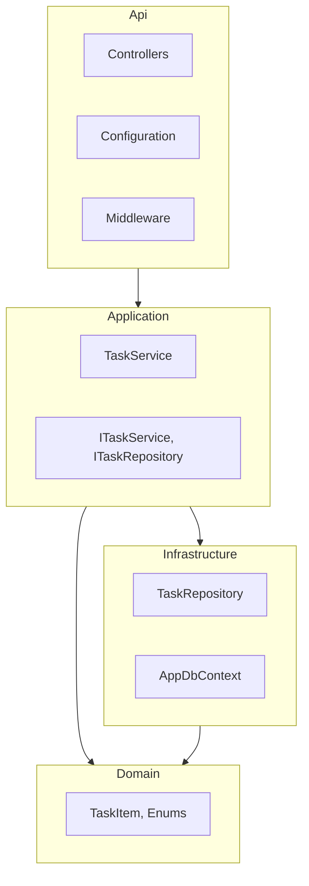
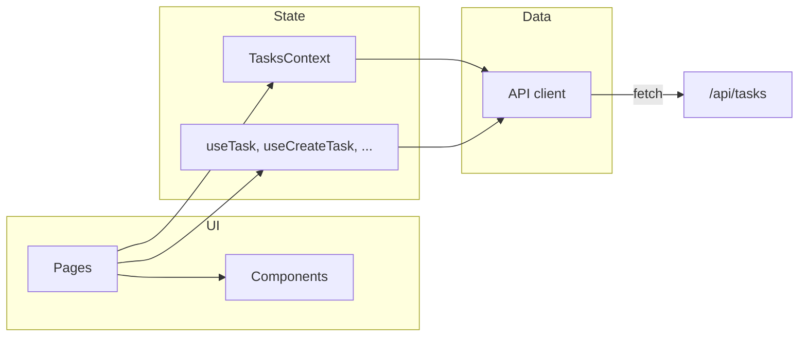
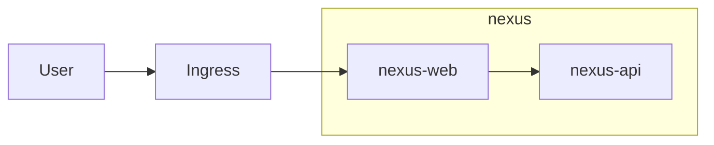

# SOLUTION.md – Design and trade-offs

## Architecture (overview)

### System

### Backend layers (dependency direction)

### Frontend (simplified)

### Kubernetes (deploy)

**Infrastructure (in `kubernetes/`):** All resources live in the **nexus** namespace. **ConfigMap** supplies the API with `ASPNETCORE_URLS` and environment. **nexus-api** and **nexus-web** are Deployments (2 replicas each) with resource limits, liveness/readiness probes (`/health` for API, `/` for web), and PodDisruptionBudgets (minAvailable: 1). ClusterIP **Services** expose the API on port 5000 and the web on 80; the web container proxies `/api` to the API service. Optional **Ingress** sends external traffic to the web service. **Kustomize** wires resources and image names for `kubectl apply -k` or Argo CD.

---

## Design decisions

### Backend (C# / ASP.NET Core)

- **Layered structure (separation of concerns)**  
  - **Domain**: `TaskItem`, `TaskStatus`, `TaskPriority` – no dependencies.  
  - **Application**: DTOs, `ITaskRepository`, `ITaskService`, `TaskService` – orchestration and use cases.  
  - **Infrastructure**: EF Core `AppDbContext`, `TaskRepository` – persistence.  
  - **Api**: Controllers, validation, options, global exception middleware – HTTP and configuration only.

- **Options pattern and config sections**  
  - `ApiOptions` and `CorsOptions` are bound from **appsettings.json** sections `Api` and `Cors`.  
  - CORS origins and Swagger toggle are driven by config, not hard-coded.

- **SOLID**  
  - **S** – Controllers handle HTTP; `TaskRequestValidator` only validates; `TaskService` only implements use cases.  
  - **O** – Sort behaviour is a simple parameter (`sortDueDateAsc`); repository can be extended with more strategies without changing callers.  
  - **L** – N/A (no inheritance hierarchy).  
  - **I** – `ITaskRepository` and `ITaskService` are focused interfaces.  
  - **D** – API and Application depend on `ITaskRepository` / `ITaskService`; Infrastructure implements them.

- **Validation and errors**  
  - Request validation is done in a dedicated validator; controllers return **RFC 7807 ProblemDetails** (including `errors` for validation).  
  - A **global exception handler middleware** turns unhandled exceptions into ProblemDetails and enables consistent HTTP logging.

- **EF Core InMemory**  
  - Used as required; seed data is applied on startup so `GET /api/tasks` returns example tasks.  
  - Search uses case-insensitive string checks compatible with InMemory (no SQL-specific `EF.Functions.Like`).

### Frontend (React + TypeScript)

- **Context API**  
  - `TasksProvider` holds list state (tasks, loading, error, search, sort) and exposes `refetch`, `setSearchQuery`, `setSortDueDateAsc`.  
  - List view and create/edit pages use the same context where needed (e.g. refetch after create/update).

- **Custom hooks**  
  - `useTasksContext()` – access tasks context.  
  - `useTask(id)` – load a single task (e.g. for edit).  
  - `useCreateTask`, `useUpdateTask` – submit create/update and handle loading/error.  
  - `useApiError` – map API errors to a single message (used with create/update).

- **Config**  
  - API base URL comes from **environment**: `VITE_API_BASE_URL` (see `frontend/.env.example`). Defaults to `http://localhost:5000` in code if unset.

- **Strong types**  
  - `Task`, `ProblemDetails`, and request/response shapes are typed; `mapApiErrorToMessage` works with the ProblemDetails shape from the API.

- **Routing**  
  - `/` – task list.  
  - `/tasks/new` – create task.  
  - `/tasks/:id/edit` – edit task.  
  - Loading and error states are shown; validation/error messages surface `detail` or validation `errors` from ProblemDetails.

---

## Trade-offs: advantages and disadvantages

The following table summarises the main design choices, their benefits, and their drawbacks.

| Area | Choice | Advantages | Disadvantages |
|------|--------|------------|----------------|
| **Persistence** | EF Core **InMemory** | No DB setup; fast startup; easy to run tests and demos; seed data on startup. | Data lost on restart; not suitable for production; no concurrency or durability guarantees. |
| **Search / sort** | Implemented in the **API** (`q`, `sort` query params) | SPA stays simple; no need to load all tasks client-side; consistent behaviour and one source of truth; scales better as data grows. | Every filter/sort change hits the network; less instant feedback than pure client-side filtering. |
| **Validation** | **Server-first** (validator + ProblemDetails), client mirrors where practical | Single source of truth on server; 400 + ProblemDetails give consistent, machine-readable errors; client can show `detail` and `errors` without duplicating full rules. | Some duplication (e.g. required title, enums); client can’t guarantee every rule without reimplementing server logic. |
| **Backend structure** | **Layered** (Domain → Application → Infrastructure → Api) | Clear separation of concerns; testable services; easy to swap persistence (e.g. InMemory → SQL) without touching controllers. | More projects and indirection; can be more than needed for a very small API. |
| **Frontend state** | **Single TasksContext** (Context API) | One place for list state; refetch and search/sort shared across list and create/edit; no extra data library. | All list consumers re-render on any context change; at scale you might split list vs. detail or use a data/cache layer (e.g. React Query). |
| **Frontend data** | **Custom hooks** (useTask, useCreateTask, useUpdateTask) | Encapsulates loading/error and API calls; reusable from any page; keeps components thin. | No built-in caching or request deduplication; each mount can trigger its own fetch. |
| **Errors** | **RFC 7807 ProblemDetails** + global exception middleware | Standard format; `detail` and `errors` map well to UI; one middleware for consistent logging and responses. | Clients must understand the shape; not all clients use ProblemDetails by default. |
| **Config** | **Options pattern** (appsettings sections) + **env** for frontend API URL | CORS, Swagger, URLs configurable without code changes; 12-factor style for API base URL in frontend. | Multiple places to look (appsettings, env files, K8s ConfigMap); env must be set at build time for Vite. |
| **K8s / deploy** | **Kustomize**, optional Ingress, **Argo CD**-friendly | Single `kubectl apply -k` or GitOps; replicas, probes, PDBs for availability; web proxy keeps SPA and API behind one ingress. | More YAML to maintain; InMemory means each API pod has its own data (no shared persistence). |

### Summary

- **InMemory** – No real DB; data is lost on restart. Acceptable for the assignment; production would use a persistent store.  
- **Search/sort in API** – Keeps the SPA simple and avoids loading all data client-side.  
- **Client-side validation** – Mirrored where practical (required title, status/priority enums, optional due date). Full rules stay on the server; 400 + ProblemDetails drive error display.  
- **Single list context** – One global list state. For this scope it’s enough; a larger app might split list vs. detail contexts or use a data library.

---

## Debugging issue: InMemory and `EF.Functions.Like`

**What happened**  
In the repository, task search was first implemented with `EF.Functions.Like(t.Title, "%" + q + "%")` for case-insensitive search. With the **InMemory** provider, this caused a runtime exception because InMemory does not support `EF.Functions.Like` in the same way as SQL providers.

**How it was diagnosed**  
- Running the API and calling `GET /api/tasks?q=test` produced an error.  
- The stack trace pointed to the repository’s LINQ query.  
- Checking EF Core docs and InMemory behaviour confirmed that not all SQL-oriented functions are supported.

**How it was resolved**  
The query was changed to use in-memory–friendly, case-insensitive logic: normalize with `ToLowerInvariant()` and use `string.Contains` (e.g. `t.Title.ToLower().Contains(q)` with `q` lowercased). This works with the InMemory provider and still respects the “case-insensitive search” requirement. For a real SQL database, you could switch back to `EF.Functions.Like` or a provider-specific equivalent and keep the same repository interface.

---

## Commit / branching approach

- **main** – stable, runnable solution.  
- Commits are small and focused: e.g. “Add ApiOptions and CorsOptions”, “Add TasksContext and useTasksContext”, “Add mapApiErrorToMessage and unit test”.  
- No long-lived feature branches for this scope; optional: a single `dev` branch for WIP before merging to `main`.
